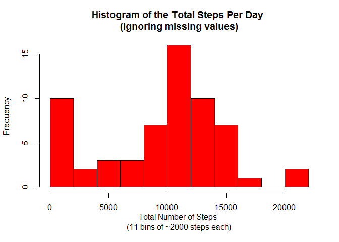
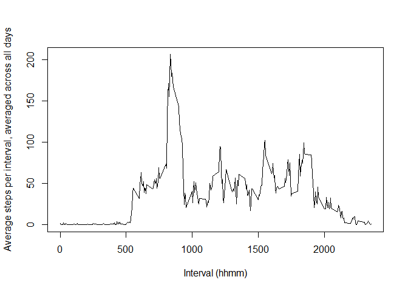
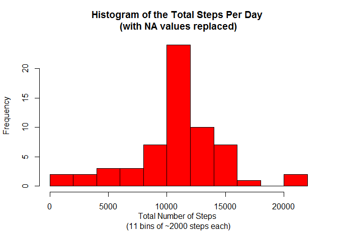
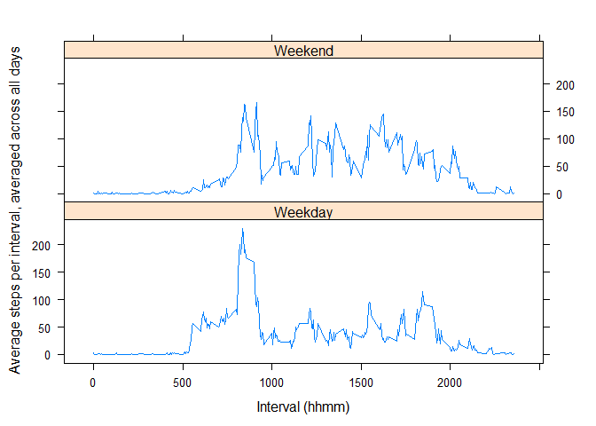

# Reproducible Research: Peer Assessment 1


## Loading and preprocessing the data
Load the required libraries

```r
library(dplyr)
library(lattice) 
```

  **1. Load the raw dataset from the working directory:**

```r
raw_data <- read.csv(file='activity.csv',header=TRUE)
```

  **2. Process/transform the data (if necessary) into a format suitable for your analysis.**
  
  **IMPORTANT** The 5-minute interval is represented as <*hhmm*>. For example the sequence runs [*...,45,50,55,100,105,110,...*]. This is not immediately obvious and the reader should keep this in mind when reviewing results! I have chosen **not** to change this approach in the following analysis. 

## What is mean total number of steps taken per day?

  **1. Calculate the total number of steps taken per day ignoring the missing values in the dataset.**

```r
raw_grouped_date <- group_by(raw_data,date)

total_steps_per_day <- summarise(raw_grouped_date,count = sum(steps,na.rm=TRUE))
```


  **2. Make a histogram of the total number of steps per day.**

```r
hist(total_steps_per_day$count,
     main="Histogram of the Total Steps Per Day \n(ignoring missing values)",
     col="Red",
     breaks=11, 
     xlab="Total Number of Steps \n(11 bins of ~2000 steps each)",
     ylab="Frequency")
```

 


  **3. Calculate and report the mean and median of the total number of steps taken per day**

```r
mean_tspd <- mean(total_steps_per_day$count)
median_tspd <- median(total_steps_per_day$count)
```

The mean for the total number of steps taken per day is 9354.23

The median for the total number of steps taken per day is 10395.00

## What is the average daily activity pattern?

  **1. Make a time series plot (i.e. type = "l") of the 5-minute interval (x-axis) and the average number of steps taken, averaged across all days (y-axis)**

First we calculate the average number of steps per 5-minute interval averaged across all days. Again ignoring any missing values.


```r
raw_grouped_interval <- group_by(raw_data,interval)
        
mean_steps_per_interval <- summarise(raw_grouped_interval, mean_steps = mean(steps,na.rm=TRUE))
```

  Next we plot the resulting dataset.


```r
plot(mean_steps_per_interval$interval,mean_steps_per_interval$mean_steps,pch="",
     xlab="Interval (hhmm)",
     ylab="Average steps per interval, averaged across all days")
lines(mean_steps_per_interval$interval,mean_steps_per_interval$mean_steps)
```

 


  **2. Which 5-minute interval, on average across all the days in the dataset, contains the maximum number of steps?**

  Use *which.max()* to find the index of interval with the largest number of steps and then return that interval.

```r
max_interval <- mean_steps_per_interval$interval[which.max(mean_steps_per_interval$mean_steps)]
```
  The interval <*hhmm*> that contains the maximum number of steps is: 835


## Imputing missing values

  **1. Calculate and report the total number of missing values in the dataset (i.e. the total number of rows with NAs)**

  Checking each of the variables for missing values

```r
count_na_steps <- sum(is.na(raw_data$steps))
count_na_date <- sum(is.na(raw_data$date))
count_na_interval <- sum(is.na(raw_data$interval))

count_na_total <- sum(is.na(raw_data))
```
  Tells us that there are 2304 steps missing, 0 dates missing and 0 intervals missing. As only one variable *steps* has missing values we don't need to worry about double counting a row in our total.
  
  Therefor the total number of missing values in the dataset is:  2304
  

  **2. Devise a strategy for filling in all of the missing values in the dataset. The strategy does not need to be sophisticated. For example, you could use the mean/median for that day, or the mean for that 5-minute interval, etc.**

  As only the *steps* variable had missing values the following strategy was choosen to fill them.

  The missing steps values were populated using the average number of steps per 5-minute interval averaged across all days of the dataset. These values were sourced from the (*mean_steps_per_interval*) dataset which was calculated when we were looking at daily activity patterns above.
  
  The code to do this is detailed in the next section.

  **3. Create a new dataset that is equal to the original dataset but with the missing data filled in.**

  First the raw dataset (*raw_data*) is merged with the dataset containing the mean steps using the interval.

```r
fixed_data <- merge(raw_data,mean_steps_per_interval)
```
  We then replace the steps value with the mean_steps value where *is.na(steps)* returns TRUE

```r
fixed_data$steps[is.na(fixed_data$steps)]<- fixed_data$mean_steps[is.na(fixed_data$steps)]
```
  Finally we drop the mean_steps column.

```r
fixed_data$mean_steps <- NULL

filter(mean_steps_per_interval,mean_steps_per_interval$interval==2355)
```

```
## Source: local data frame [1 x 2]
## 
##   interval mean_steps
## 1     2355   1.075472
```

```r
tail(fixed_data)
```

```
##       interval    steps       date
## 17563     2355 0.000000 2012-10-16
## 17564     2355 0.000000 2012-10-07
## 17565     2355 0.000000 2012-10-25
## 17566     2355 0.000000 2012-11-03
## 17567     2355 1.075472 2012-10-08
## 17568     2355 1.075472 2012-11-30
```
Here we can see that the NA at interval 2355 in 2012-10-08 and 2012-11-30 have been replaced by the corresponding mean value while the other values are unchanged.

  **4. Make a histogram of the total number of steps taken each day and Calculate and report the mean and median total number of steps taken per day.**

  The histogram is generated using the same method as before for the fixed version of the dataset.
  

```r
fixed_grouped_date <- group_by(fixed_data,date)

fixed_total_steps_per_day <- summarise(fixed_grouped_date,count = sum(steps,na.rm=TRUE))

hist(fixed_total_steps_per_day$count,
     main="Histogram of the Total Steps Per Day \n(with NA values replaced)",
     col="Red",
     breaks=11, 
     xlab="Total Number of Steps \n(11 bins of ~2000 steps each)",
     ylab="Frequency")
```

 

  The mean and median were also recalculated using the fixed version of the dataset.
  

```r
mean_ftspd <- mean(fixed_total_steps_per_day$count)
median_ftspd <- median(fixed_total_steps_per_day$count)
```

The mean for the fixed total number of steps taken per day is 10766.19

The median for the fixed total number of steps taken per day is 10766.19

**Do these values differ from the estimates from the first part of the assignment?**

  The spike in the original histogram in the 0-2000 bucket due to missing values has now been redistributed with the new histogram presenting a smoother distribution.
  
  The mean value increased from 9354.23 to 10766.19, while the median value increased from 10395.00 to 10766.19

**What is the impact of imputing missing data on the estimates of the total daily number of steps?**

  The difference between the two estimates has effectively vanished.

## Are there differences in activity patterns between weekdays and weekends?

**1.Create a new factor variable in the dataset with two levels – “weekday” and “weekend” indicating whether a given date is a weekday or weekend day.**

  The new factor weekend is added using the *weekdays()* function to return the day for a given date, which is then used by the *ifelse()* function to set the factor to either "Weekend" or "Weekday".

```r
fixed_data$weekend <- as.factor(ifelse(weekdays(as.Date(fixed_data$date)) %in% c("Saturday","Sunday"),"Weekend","Weekday"))

head(fixed_data)
```

```
##   interval    steps       date weekend
## 1        0 1.716981 2012-10-01 Weekday
## 2        0 0.000000 2012-11-23 Weekday
## 3        0 0.000000 2012-10-28 Weekend
## 4        0 0.000000 2012-11-06 Weekday
## 5        0 0.000000 2012-11-24 Weekend
## 6        0 0.000000 2012-11-15 Weekday
```

**2.Make a panel plot containing a time series plot (i.e. type = "l") of the 5-minute interval (x-axis) and the average number of steps taken, averaged across all weekday days or weekend days (y-axis).**

First we calculate the average number of steps per 5-minute interval averaged across all days, using the fixed dataset.


```r
fixed_grouped_interval <- group_by(fixed_data,interval,weekend)
        
fixed_mean_steps_per_interval <- summarise(fixed_grouped_interval, mean_steps = mean(steps,na.rm=TRUE))

head(fixed_mean_steps_per_interval)
```

```
## Source: local data frame [6 x 3]
## Groups: interval
## 
##   interval weekend mean_steps
## 1        0 Weekday 2.25115304
## 2        0 Weekend 0.21462264
## 3        5 Weekday 0.44528302
## 4        5 Weekend 0.04245283
## 5       10 Weekday 0.17316562
## 6       10 Weekend 0.01650943
```


  Next we plot the resulting dataset.


```r
xyplot(fixed_mean_steps_per_interval$mean_steps ~ fixed_mean_steps_per_interval$interval | fixed_mean_steps_per_interval$weekend, 
       date=fixed_mean_steps_per_interval,
       layout = c(1,2),
       stack=TRUE,
       panel = panel.lines,
       xlab="Interval (hhmm)",
       ylab="Average steps per interval, averaged across all days")
```

 


